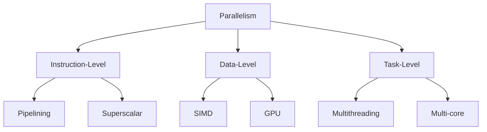
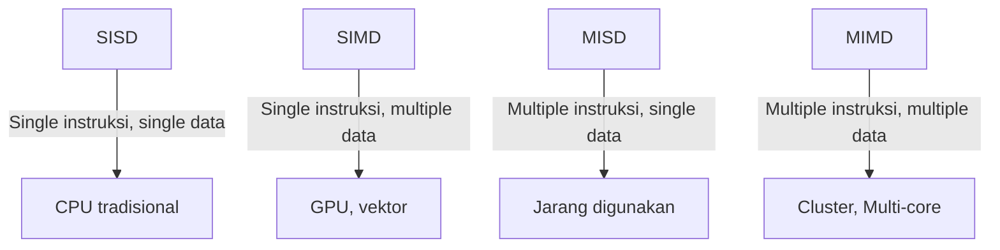
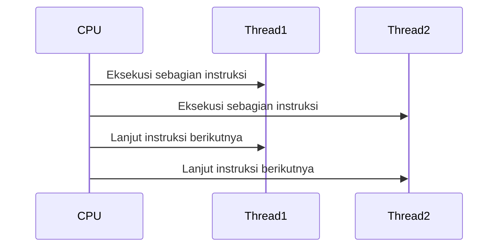
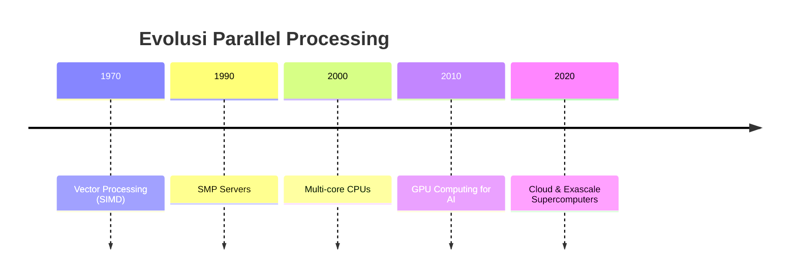

# Modul Minggu 15
## Parallel Processing & Multiprocessing

---

## 1. Pendahuluan

Parallel Processing dan Multiprocessing adalah dua konsep penting dalam arsitektur komputer modern. 
Seiring meningkatnya kebutuhan komputasi (AI, big data, simulasi ilmiah), komputer harus mampu menjalankan banyak instruksi secara bersamaan.

- **Parallel Processing**: eksekusi banyak instruksi pada waktu yang sama.  
- **Multiprocessing**: penggunaan banyak prosesor (CPU) dalam satu sistem.

Keduanya bertujuan meningkatkan **throughput**, **efisiensi**, dan **scalability**.

---

## 2. Motivasi Parallel Processing

- **Batas frekuensi CPU**: tidak mungkin meningkatkan kecepatan clock terus-menerus karena panas & konsumsi daya.  
- **Amdahl’s Law**: performa terbatas oleh bagian program yang tidak bisa diparalelkan.  
- **Moore’s Law**: transistor semakin banyak → lebih baik dipakai untuk core tambahan daripada hanya menaikkan clock.

**Tabel Perbandingan Pendekatan:**

| Pendekatan   | Cara Meningkatkan Kinerja | Kelemahan |
|--------------|----------------------------|-----------|
| Clock Speed  | Naikkan frekuensi          | Panas, boros daya |
| Parallelism  | Tambah core / thread       | Perlu software paralel |

---

## 3. Jenis Parallelism

### 3.1 Instruction-Level Parallelism (ILP)
- Eksekusi instruksi secara overlapped (pipelining).  
- Superscalar CPU → eksekusi beberapa instruksi per cycle.

### 3.2 Data-Level Parallelism (DLP)
- Operasi yang sama pada banyak data.  
- SIMD (Single Instruction Multiple Data).  
- Contoh: GPU.

### 3.3 Task-Level Parallelism (TLP)
- Menjalankan beberapa task berbeda secara bersamaan.  
- Multi-threading, multi-core.

**Diagram Jenis Parallelism (Mermaid):**

---

## 4. Klasifikasi Flynn

Flynn mengklasifikasikan komputer berdasarkan instruksi & data:

- **SISD**: Single Instruction, Single Data (CPU klasik).  
- **SIMD**: Single Instruction, Multiple Data (GPU, vector processor).  
- **MISD**: Multiple Instruction, Single Data (jarang dipakai).  
- **MIMD**: Multiple Instruction, Multiple Data (multi-core, cluster).

**Diagram Flynn Taxonomy (Mermaid):**

---

## 5. Multiprocessing

### 5.1 Symmetric Multiprocessing (SMP)
- Semua CPU setara.  
- Berbagi memori utama.  
- Contoh: server multi-core.

### 5.2 Asymmetric Multiprocessing (AMP)
- Satu CPU master, yang lain worker.  
- Digunakan di sistem embedded.

**Perbandingan SMP vs AMP:**

| Aspek     | SMP                | AMP                  |
|-----------|--------------------|----------------------|
| Kontrol   | Semua CPU setara   | Satu CPU master      |
| Efisiensi | Tinggi             | Bergantung master    |
| Contoh    | Server modern      | Embedded system      |

---

## 6. Multithreading

- **Coarse-grained**: switch thread bila ada stall.  
- **Fine-grained**: switch thread setiap cycle.  
- **Simultaneous Multithreading (SMT)**: eksekusi beberapa thread dalam satu cycle (contoh: Intel Hyper-Threading).

**Diagram Multithreading (Mermaid):**

---

## 7. Cluster & Parallel Computing

- **Cluster**: kumpulan komputer yang bekerja sama.  
- **Grid/Cloud**: distribusi kerja via internet.  
- **GPU Parallelism**: ribuan core kecil untuk deep learning.

**Contoh:** Superkomputer Fugaku (Jepang), Frontier (AS).

---

## 8. Studi Kasus

1. **Database Server Multi-core**  
   - Query diproses paralel.  

2. **GPU dalam Deep Learning**  
   - Training model AI → operasi matriks besar paralel.  

3. **Superkomputer**  
   - Simulasi iklim, genom, astrofisika.

---

## 9. Tantangan Parallel Processing

- **Synchronization**: menjaga konsistensi data antar thread.  
- **Race Condition**: hasil berbeda bila eksekusi tidak dikontrol.  
- **Deadlock**: proses saling menunggu.  
- **Scalability**: tidak semua algoritma bisa diparalelkan (Amdahl’s Law).

---

## 10. Ringkasan & Refleksi

### Ringkasan
- Parallel Processing = eksekusi instruksi serentak.  
- Multiprocessing = banyak prosesor bekerja bersama.  
- Flynn Taxonomy → SISD, SIMD, MISD, MIMD.  
- SMP vs AMP → simetri vs master-slave.  
- Multithreading & GPU → kunci performa modern.

### Refleksi
- Mengapa tidak semua program dapat diparalelkan?  
- Apa bedanya SIMD vs MIMD?  
- Mengapa sinkronisasi penting?  

---

## 11. Sumber Belajar Online

- [Parallel Processing – GeeksforGeeks](https://www.geeksforgeeks.org/parallel-processing-in-computer-organization/)  
- [Flynn’s Taxonomy – TutorialsPoint](https://www.tutorialspoint.com/flynns-taxonomy-in-computer-architecture)  
- [Multiprocessing – W3Schools](https://www.w3schools.in/operating-system/multiprocessing)

---

## 12. Latihan

1. Jelaskan perbedaan parallel processing dan multiprocessing.  
2. Gambarkan diagram klasifikasi Flynn.  
3. Bandingkan SMP vs AMP.  
4. Apa peran GPU dalam AI?  
5. Berikan contoh masalah yang sulit diparalelkan.  

---

## 13. Evolusi Parallel Processing

- **1970-an**: Mainframe mulai gunakan vector processing (SIMD).  
- **1990-an**: Multiprocessor server → SMP.  
- **2000-an**: CPU multi-core di desktop/laptop.  
- **2010-an**: GPU parallelism untuk AI.  
- **Sekarang**: Cloud & exascale computing.

**Diagram Evolusi (Mermaid):**

---
