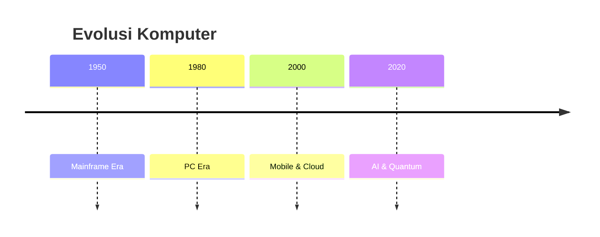
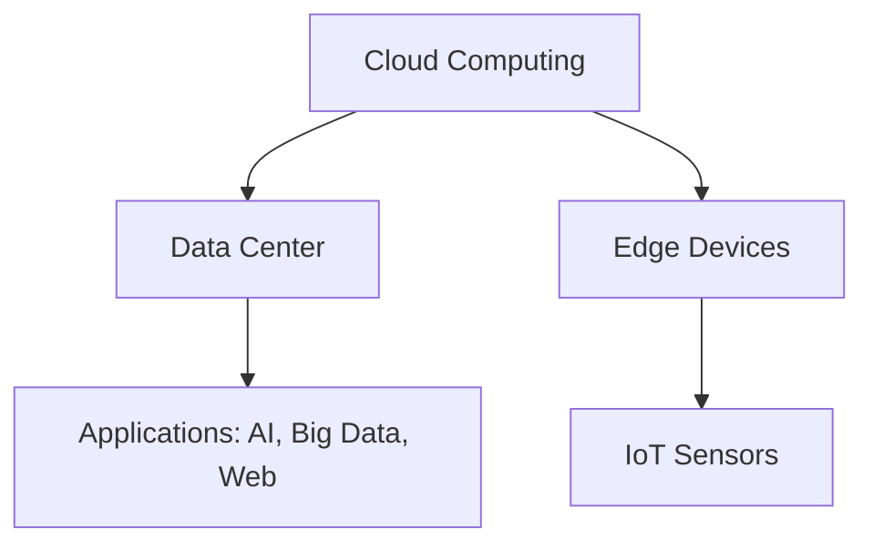
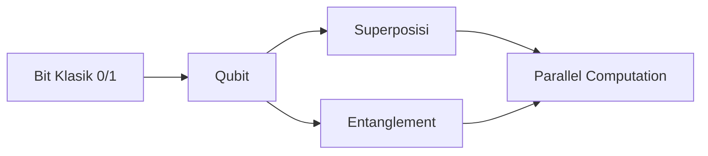
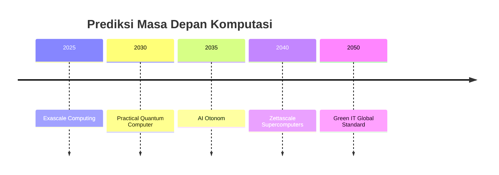

# Modul Minggu 16
## Tren Perkembangan Teknologi Komputer

---

## 1. Pendahuluan

Teknologi komputer berkembang dengan kecepatan luar biasa. Dahulu komputer berukuran sebesar ruangan penuh, kini bisa berada di genggaman tangan. 
Hukum Moore yang memprediksi jumlah transistor akan berlipat ganda setiap 18–24 bulan telah menjadi pendorong utama, meski kini kita mulai memasuki era post-Moore.

Tren utama meliputi: komputasi paralel, cloud, AI, komputasi kuantum, neuromorfik, dan green computing.

---

## 2. Sejarah Perkembangan Komputer

- **Mainframe Era (1950–1970)**  
  Komputer besar digunakan perusahaan & riset.  

- **PC Era (1980–2000)**  
  Komputer pribadi mulai masif.  

- **Mobile & Cloud Era (2000–2020)**  
  Smartphone dan cloud computing mendominasi.  

- **AI & Quantum Era (2020–sekarang)**  
  AI generatif, superkomputer exascale, dan riset quantum.

**Diagram Evolusi Komputer (Mermaid):**

---

## 3. Tren Hardware

### 3.1 CPU Multi-core
- Transistor lebih banyak dimanfaatkan untuk core tambahan.  
- CPU modern: 8–64 core.  

### 3.2 GPU & TPU
- GPU (NVIDIA, AMD) → akselerasi AI.  
- TPU (Google) → khusus deep learning.

### 3.3 Quantum Computing
- Qubit, superposisi, entanglement.  
- IBM Q, Google Sycamore.

### 3.4 Neuromorphic Chips
- Meniru otak manusia.  
- Intel Loihi, IBM TrueNorth.

**Tabel Tren Hardware:**

| Teknologi    | Contoh Produk      | Fungsi |
|--------------|-------------------|--------|
| CPU Multi-core | AMD EPYC, Intel Xeon | Komputasi umum |
| GPU          | NVIDIA A100        | AI, grafis |
| TPU          | Google TPU v4      | Deep learning |
| Quantum      | IBM Q, Sycamore    | Riset kuantum |
| Neuromorphic | Intel Loihi        | AI hemat energi |

---

## 4. Tren Software & Arsitektur

- **Virtualization & Containerization**  
  VMware, Docker, Kubernetes.  

- **Cloud Computing**  
  AWS, Azure, GCP.  

- **Edge & Fog Computing**  
  Pemrosesan dekat dengan IoT device.

**Diagram Arsitektur Modern (Mermaid):**

---

## 5. AI & Machine Learning

- **Deep Learning** dengan GPU/TPU.  
- **LLM (Large Language Models)**: GPT, BERT.  
- **AI Embedded**: AI di IoT, mobil otonom.

---

## 6. Komputasi Kuantum

- **Qubit**: bisa 0 dan 1 bersamaan (superposisi).  
- **Entanglement**: qubit saling terhubung.  
- Potensi: kriptografi, simulasi, optimasi.

**Diagram Komputasi Kuantum (Mermaid):**

---

## 7. Neuromorphic & Brain-Inspired Computing

- Chip meniru neuron & sinapsis.  
- Lebih efisien energi.  
- Digunakan untuk AI low-power.

Contoh: Intel Loihi, IBM TrueNorth.

---

## 8. Green Computing & Sustainability

- Superkomputer hemat energi (Top500 Green500).  
- Data center ramah lingkungan.  
- Desain chip hemat daya.  

**Tabel Green Computing:**

| Area         | Teknologi          | Contoh |
|--------------|-------------------|--------|
| Data Center  | Pendingin alami   | Google Data Center |
| Superkomputer| Energy-efficient HPC | Fugaku, Frontier |
| Chip Design  | Low-power ARM CPU | Smartphone |

---

## 9. Studi Kasus

1. **Frontier (AS)**  
   - Superkomputer pertama exascale.  

2. **Google Sycamore**  
   - Quantum supremacy (2019).  

3. **NVIDIA H100 GPU**  
   - Untuk AI generatif.  

---

## 10. Ringkasan & Refleksi

### Ringkasan
- Tren utama: multi-core, GPU/TPU, quantum, neuromorphic, cloud, edge.  
- AI mendorong kebutuhan hardware khusus.  
- Green computing makin penting.  

### Refleksi
- Apakah Moore’s Law sudah berakhir?  
- Bisakah quantum menggantikan komputer klasik?  
- Apa peran generasi TI di era AI?  

---

## 11. Sumber Belajar Online

- [Future of Computing – GeeksforGeeks](https://www.geeksforgeeks.org/future-of-computing/)  
- [Quantum Computing Basics – IBM](https://www.ibm.com/quantum-computing/)  
- [Cloud Computing – W3Schools](https://www.w3schools.com/cloud/)  

---

## 12. Latihan

1. Jelaskan tren hardware dekade terakhir.  
2. Apa itu komputasi kuantum?  
3. Bandingkan cloud vs edge computing.  
4. Apa itu green computing?  
5. Prediksi tren teknologi komputer 10 tahun ke depan.  

---

## 13. Evolusi Masa Depan

**Prediksi ke depan:**  
- Komputasi exascale & zettascale.  
- Quantum computer praktis.  
- AI yang semakin otonom.  
- Edge computing dominan untuk IoT.  
- Green IT menjadi standar.

**Diagram Masa Depan (Mermaid):**

---
